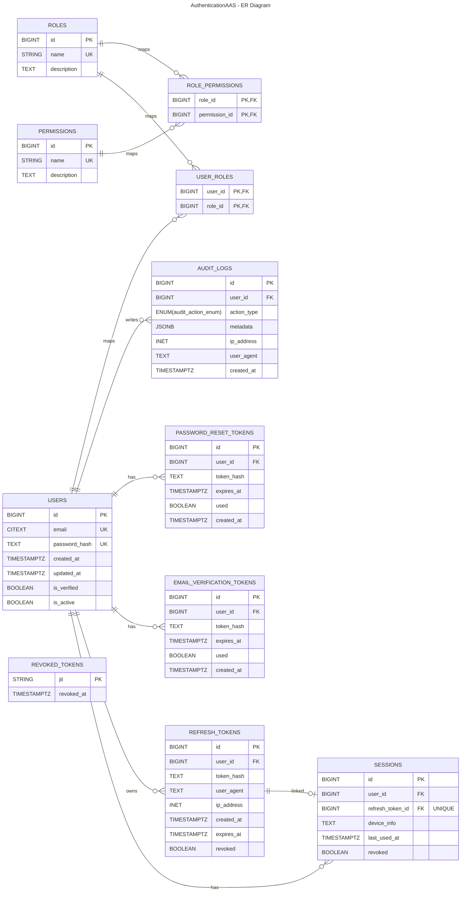

# ER Diagram (Database Schema)

This ER diagram is derived from the SQLAlchemy models in `app/models/` and the initial Alembic migration in `migrations/versions/dd9e86f763e9_initial_schema.py`.

Preview options:
- VS Code: open this file and use the Markdown Preview (Mermaid support required).
- Mermaid Live: https://mermaid.live (paste the Mermaid block below)

